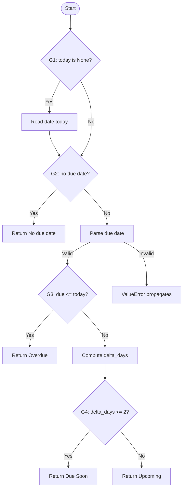
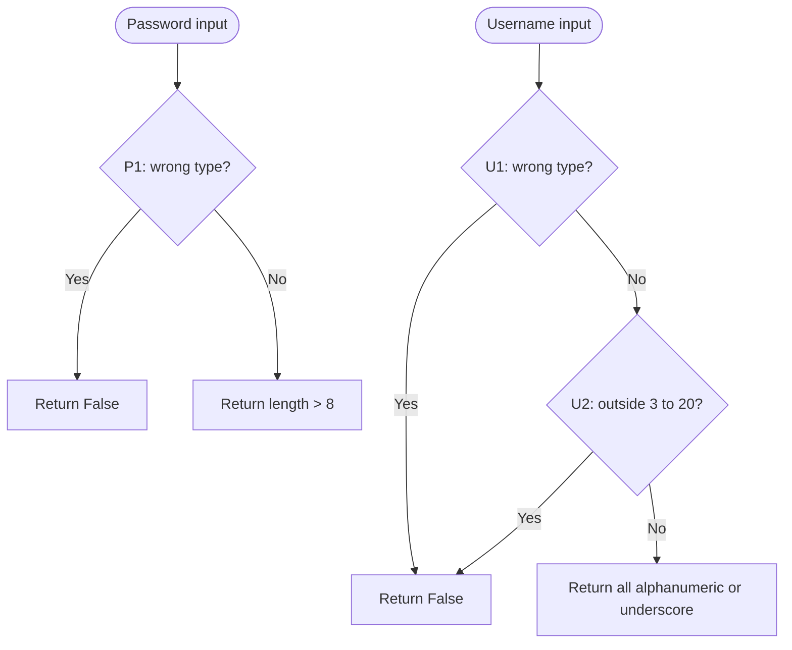
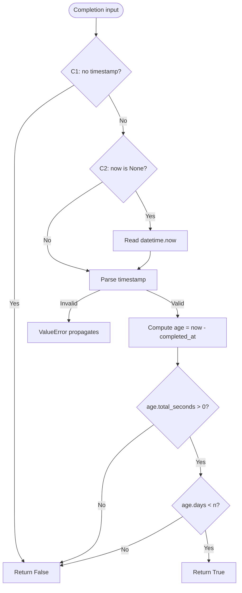

# PyTodo Pro - Week 2 white-box testing and coverage

**Course:** TEB3433 / TFB3433 Software Testing and Quality Assurance  
**Execution and report date:** 2026-10-07, Asia/Singapore  
**Team:** Names and student IDs are maintained in the [project README](../README.md).  
**Execution provenance:** Agent-executed tests; actual group reviewer: `_____`. Group members should inspect the tests, reproduce the run, and record their review before submission.

## 1. Objective, scope and selected units

Assess selected important code units using control-flow analysis, specification-based assertions, and measured statement/branch coverage. The assignment brief, pages 2-3, asks for a justified selection rather than exhaustive structural testing of the application. The course guidance shared on 2026-10-07 requires inspection, QA planning, and documentation with the supplied application unchanged. This phase uses a byte-identical copy of its small framework-free helper module. No production code, feature, route, or database was changed.

| Selected unit | Importance, complexity and risk | Source lines | Related requirement / prior finding |
|---|---|---|---|
| `is_valid_password` | Registration boundary; type guard and length condition; Week 1 failure already observed | 42-49 | R-01; DEF-W1-001 |
| `is_valid_username` | Registration validation; type/length guards, chained comparison, lazy character predicate | 52-58 | R-01 |
| `compute_urgency` | Task labels and dashboard counts; optional clock and ordered date comparisons | 12-39 | R-07; DEF-W1-002 |
| `completed_in_last_n_days` | Recent-completion dashboard metric; missing data, default clock, date parsing and short-circuit range check | 61-75 | R-09; previously untested historical boundary |

The selected module contains four functions. Flask routes, database access, HTTP status codes, ownership, GUI, compatibility, security and performance are outside this structural coverage scope and are addressed in their later phases. The 100% figures below apply only to `target/helpers.py`.

## 2. Environment and source integrity

Windows, Python 3.12.14, PyTest 9.1.1, coverage.py 7.16.2; exact platform and UTC start times are in the [baseline](evidence/baseline_results.json) and [final](evidence/final_results.json) records. The test clock is fixed to date `2026-10-07` and timestamp `2026-10-07 12:00:00`, so time boundaries do not depend on the execution machine's date. Tests use second precision, matching the documented input format.

The original source is at `C:\Users\Admin\Downloads\STQA\pytodo_pro_student`. The old application virtual environment no longer starts after relocation, so execution used a separate Python runtime and workspace-local test dependencies. A teammate can use an ordinary Python 3.12 environment with the pinned requirements. Neither Flask nor a running app is needed for these pure-function tests.

The [source manifest](evidence/source_manifest.json) records original and snapshot SHA-256 values. Helpers SHA-256: `bf9140338277534439b38599f5ac3ef722880cced732bba8f1f313147d466d80`. Original `app.py`: `050b4ee4bb7d42f9ea835b46569185177755feee8e420f861376df4e6097f30f`. The runner verifies the helper snapshot before and after each phase. The original files were also checked after execution.

## 3. Control-flow and decision analysis

These diagrams describe the existing implementation. A label's absence in the implementation is a possible correctness defect even when all implemented branches execute. Line references use the preserved [source snapshot](target/helpers.py).

### Urgency flow



### Password and username flows



### Recent-completion flow



The last diagram expands a same-line `and` expression for reasoning. Coverage.py counts the two explicit `if` decisions in this function as four branch outcomes; it does not report the expanded Boolean operands as four additional outcomes here.

### Branch witnesses and baseline gaps

| Decision | Line | True-outcome case | False-outcome case | Baseline gap |
|---|---:|---|---|---|
| G1: omitted today | 26 | 025, 026 | 018, 024 | True; line 27 |
| G2: missing due date | 28 | 018, 019 | 020, 024 | True; line 29 |
| G3: due <= today | 33 | 020, 021 | 022, 024 | True; line 34 |
| G4: delta <= 2 | 37 | 022, 023 | 024 | True; line 38 |
| P1: non-string password | 47 | 001, 002 | 004, 006 | True; line 48 |
| U1: non-string username | 54 | 007, 008 | 010 | True; line 55 |
| U2: invalid length | 56 | 009, 012, 016 | 010, 011 | True; line 57 |
| C1: missing completion | 69 | 029, 030 | 031 | True; line 70 |
| C2: omitted now | 71 | 038 | 031 | True; line 72 |

Case IDs in this table use the `TC-WB-` prefix. Manual tracing predicts 9 explicit binary decisions = 18 outcomes. The baseline takes one outcome per decision and misses the nine listed executable lines: 27, 29, 34, 38, 48, 55, 57, 70, 72. Coverage measurement agrees. Module import/definition lines account for 5 of the 31 executable statements; the four function bodies account for 26.

### Conditions, paths and data flow

| Unit | Additional condition / path checks | Definition-use consideration |
|---|---|---|
| Password | Length 7/8/9 exposes `> 8` versus the documented minimum; both expression results are exercised | Type guard dominates `len`, preventing a length operation on None/integer |
| Username | Lower/upper length guards; letter/digit predicates; underscore alternative; invalid character causes `all` to stop | Type and length checks dominate iteration; a zero-length generator path cannot be reached through an accepted username |
| Urgency | Past/today/+1/+2/+3; injected and default clock; malformed and impossible dates | `due` is defined by successful parsing; `delta_days` is defined and used only for future dates; past and today share the implemented return |
| Recent completion | Zero/future ages short-circuit; recent age evaluates both operands True; exactly N and older evaluate the second operand False; N=1 and N=7 | Missing timestamp returns before clock/parsing; parsed timestamp and reference clock define `age`; `age.days` is skipped when seconds are nonpositive |

This is targeted feasible-path and definition-use discussion. It is not a claim of exhaustive path coverage, MC/DC, or a formal data-flow coverage percentage. Malformed-date tests exercise parser failures; this source contains no `except` handler to cover. Further ranges, time zones, Unicode username policy, and arbitrary wrong types for the date helpers remain outside the current suite.

## 4. Test design and execution

The [master test repository](Master_Test_Repository.md) contains all 41 objectives, inputs, expected and actual results, statuses, path targets, and defect links. Test steps and preconditions are shared explicitly. All cases map by ID to the parameterized PyTest node and to the saved machine-readable results.

The baseline intentionally contains four representative valid cases: 006, 010, 024, and 031. It is a limited starting point for this phase, not an earlier semester execution or a copy of the Week 1 browser suite. The final suite adds missing guards, optional-clock paths, short-circuit conditions, boundaries, and parser-error observations while retaining the baseline inputs. Each phase runs in a fresh process to avoid cached imports hiding executable module lines.

Results: baseline 4 Pass; final 36 Pass / 5 Fail, no setup errors or skipped cases. Of the final 41 cases, 35 check explicit specifications (31 Pass/4 Fail), two check labeled interpretations (1 Pass/1 Fail), and four characterize unspecified invalid-date handling (4 Pass). All failures remain ordinary failing assertions. Expectations are not changed to match incorrect output.

## 5. Coverage results and interpretation

| Run | Tests | Pass | Fail | Statement coverage | Branch outcomes | Combined coverage.py percentage |
|---|---:|---:|---:|---|---|---|
| Baseline | 4 | 4 | 0 | 22/31 = 70.97% | 9/18 = 50.00% | 63.27% |
| Final | 41 | 36 | 5 | 31/31 = 100.00% | 18/18 = 100.00% | 100.00% |

Statement coverage = executed statements / executable statements. Branch coverage = executed branch outcomes / possible measured outcomes. With branch measurement enabled, coverage.py's text `Cover` column combines statement and branch opportunities: baseline (22+9)/(31+18) = 63.27%. It is not the standalone statement percentage. The JSON reports retain each denominator separately.

| Function | Final statements | Final branch outcomes |
|---|---:|---:|
| `compute_urgency` | 11/11 | 8/8 |
| `is_valid_password` | 3/3 | 2/2 |
| `is_valid_username` | 5/5 | 4/4 |
| `completed_in_last_n_days` | 7/7 | 4/4 |
| Module import and definitions | 5/5 | 0 |

Final missing-line and missing-branch lists are empty. No exclusion pragmas or coverage threshold were used. Tests with failing assertions still execute the helper and contribute coverage. Full coverage of the implemented paths coexists with five failed assertions; missing desired behavior such as a distinct `Due Today` return is not an unexecuted existing line. Coverage alone therefore cannot establish correctness or full requirements coverage.

Evidence: [baseline text](evidence/baseline_coverage.txt), [final text](evidence/final_coverage.txt), [baseline JSON](evidence/baseline_coverage.json), [final JSON](evidence/final_coverage.json), and browsable [baseline HTML](evidence/baseline_html/index.html) / [final HTML](evidence/final_html/index.html). HTML reports can be opened after cloning; GitHub does not render their interactive view as a hosted site. XML coverage and JUnit files are also saved for later automation integration. The lab's separate target is not used as a project grading threshold.

## 6. Findings and defect traceability

| Finding | Cases | Expected / actual | Status |
|---|---|---|---|
| DEF-W1-001 password minimum | 005 | Eight-character password True / False | Existing defect reproduced by unit test; original [defect record](../01_Black_Box/Defect_Log.md#def-w1-001---exactly-8-characters-rejected-as-a-password) retained |
| DEF-W1-002 due today | 021 | Due Today / Overdue | Existing defect reproduced by unit test; original [defect record](../01_Black_Box/Defect_Log.md#def-w1-002---due-today-task-marked-overdue) retained |
| DEF-W2-001 inclusive completion limit | 034, 039 | Exactly N days True / False | New confirmed unit-level mismatch with explicit docstring |
| Associated zero-age observation | 032 | Completion at now True / False | Interpreted expectation; confirm the intended zero-age rule |

### New defect DEF-W2-001

- **Title:** Recent-completion helper excludes the inclusive N-day boundary.
- **Affected feature / requirement:** Dashboard recent-completion count, R-09; `completed_in_last_n_days`.
- **Environment:** As section 2; unchanged helper source, fixed `now=2026-10-07 12:00:00`, no Flask or database.
- **Precondition:** A valid completion timestamp and positive N; helper documentation includes exactly N days ago.
- **Steps:** (1) Call `completed_in_last_n_days("2026-09-30 12:00:00", n=7, now=datetime(2026,10,7,12,0,0))`. (2) Compare with `2026-09-30 12:00:01` (one second inside) and `2026-09-30 11:59:59` (one second outside). (3) Repeat at N=1 with `2026-10-06 12:00:00`.
- **Expected:** Exactly N days and one second inside return True; one second outside returns False. The exactly-N inclusion is explicit in the function's docstring.
- **Actual:** Exactly N returns False for both N=7 and N=1. Inside returns True; outside returns False. The comparison `age.days < n` excludes the documented inclusive endpoint.
- **Severity / priority:** Moderate / Medium; a boundary completion is omitted from the intended metric. This run establishes the helper defect, not a separate end-to-end dashboard reproduction.
- **Evidence:** TC-WB-033/034/035/039 in the [case repository](Master_Test_Repository.md#recent-completion-window), assertion output in [final_pytest.txt](evidence/final_pytest.txt), and [structured results](evidence/final_results.json).
- **Status:** Confirmed at unit level; open. Group review and any UI/API reproduction remain pending. No application correction was applied.
- **Recommendation:** The maintainer should agree the precise inclusive timestamp interval and align the predicate with it. Keep tests at both ends of that interval.
- **Associated observation:** With `completed_at == now`, the current `age.total_seconds() > 0` also returns False (032). Inclusion of the current instant is a labeled interpretation of “within the last N days”; the exact-N mismatch above is confirmed independently of this interpretation.

## 7. Reproduction

From the repository root, in PowerShell with Python 3.12 available:

```powershell
python -m venv .venv
.\.venv\Scripts\Activate.ps1
python -m pip install -r .\02_White_Box_Coverage\requirements-test.txt
python .\02_White_Box_Coverage\run_tests.py
```

The runner records both phases under `evidence/`, replacing their existing results. Archive that folder before a new run if retaining this execution is needed. The final process exits with status **1** when assertions fail; that is the recorded finding state, not an installation failure. Inspect the log if results differ. Test data fixes the clocks, so all five failures should reproduce against this source snapshot; do not suppress them merely to obtain exit status zero.

To run only the final unit suite with coverage from its folder:

```powershell
cd .\02_White_Box_Coverage
python -m coverage run --branch -m pytest -v
python -m coverage report -m
```

That direct command is useful for investigation; use `run_tests.py` when regenerating the complete baseline/final evidence package. The reproduction scripts and test requirements are part of this phase's deliverables.

## 8. Guideline coverage and limits

| Required content (brief, pages 2-3) | Location |
|---|---|
| Selected units and justification | Section 1 |
| Control-flow and decision analysis | Section 3; diagrams, branch witnesses, condition and data-flow discussion |
| White-box cases and automated tests | Master_Test_Repository.md; tests/ |
| Measured coverage and uncovered-code interpretation | Sections 4-5; evidence/ |
| Findings, residual risks and recommendations | Section 6 and this section |

The selection is deliberately limited to four helpers. HTTP integration, historical dashboard counts in a running app, broad Unicode/input-type policies, timezone semantics, accessibility, security, performance, and compatibility are not established by these results. PyTest execution is automated evidence; named group members have not yet reviewed or reproduced this run. Student IDs and the group reviewer should be completed before the combined submission. Weekly deliverables remain part of the planned combined submission around Week 10.

**Sources:** Supplied `Group Project.pdf`, pages 2-3, at `C:\Users\Admin\Downloads\STQA\pytodo_pro_student\Group Project.pdf`; preserved helper source/docstrings; course guidance supplied by the user on 2026-10-07. Test outcomes and coverage figures come from the linked execution artifacts, not estimates.
